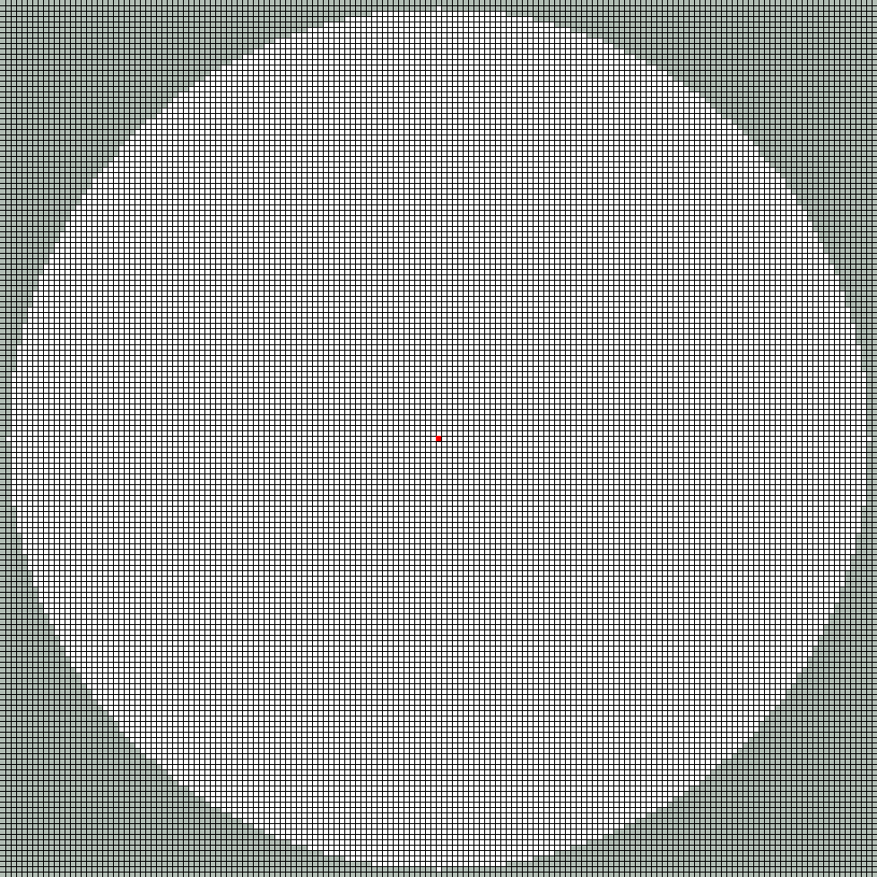
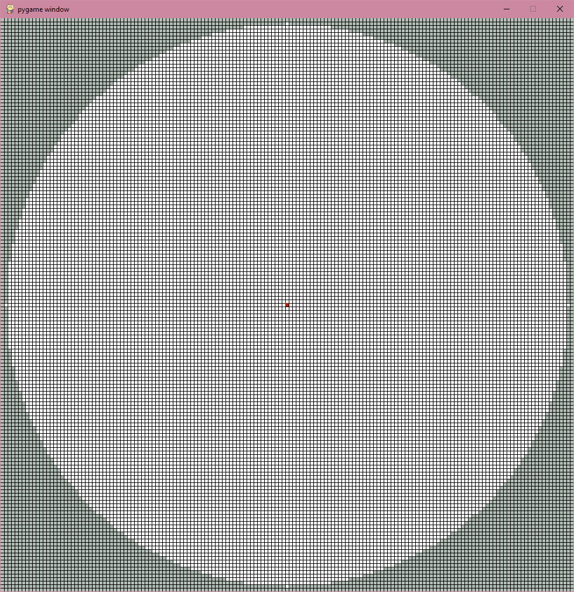

# analog-press
Alternative DAC for box style controllers which aims to more closely follow traditional analog stick behavior. The code in this repository allows you to visualize the inputs of this DAC, as well as the DAC currently used by box-style controllers. To see how analog press works, head to [DAC Methodology](#dac-methodology)

## Dependencies
Currently, to run the project, you will need to install python. In the future, a packaged app may be released, but getting started with python is very straightforward. I recommed getting started with [VS Code](https://code.visualstudio.com/docs/python/python-tutorial).
You will also need to install [pygame](https://www.pygame.org/wiki/GettingStarted) to run the program.

## General Usage
Run *main.py* to start the program. A window will appear with a grid that visualizes the melee stick coordinates. The squares in grey are values with a distance greater than 1 from the center, and the white squares compose the valid stick coordinates. The red square is the current stick position that is sent to the console. To stop the visualization from running, you can either hit your **ESC** key, or close the window. Pressing keys will cause the cursor to move, in the way defined by the DAC in use.
<p align="center">
  
  <br />Default window appearance
</p>  

## Keybindings
The default keybindings are as follows:

Note that only the buttons necessary to generate or modify coordinate values have been mapped. The keybinds are contained in the *keymap.py* folder. Simply change the variable to the key you wish to use. The names of the pygame constants are available [here](https://www.pygame.org/docs/ref/key.html). 

For example, if I wished to change my notch key from left shift to space bar,
```python
NOTCH = pygame.K_LSHIFT
```
would become
```python
NOTCH = pygame.K_SPACE
```
Note that the **SLOW**, and **HOLD** buttons correspond to **Modifier X** and **Modifier Y** in the conventional DAC, respectively. 
## DAC Selection
In the **update_pos** function in *main.py*, the boolean **use_boxx** allows you to select whih DAC to use. When True, it uses the Frame1 implementation, and when False uses Analog Press.

## DAC Methodology
### Conventional DAC
The DAC coordinates are taken straight from Arte's pico rectangle firmware [here](https://github.com/JulienBernard3383279/pico-rectangle/blob/master/src/dac_algorithms/melee_F1.cpp). This is based on the current Frame1 DAC, which means there are some nerfs found on the b0xx that are not implemented. If you wish to understand why certain coordinates values were chosen, and the combinations of buttons that yield certain coordinates, you can read the **b0xx SSBM [instruction manual](https://drive.google.com/file/d/1InBmEJkWi3E5ReAUIGM9loHygaoNODcf/view).**

### Analog Press - Motivation
Analog press attempts to make it so that a digital button press can behave more similarly to an analog stick. The conventional DAC scheme maps a combination of buttons pressed to a specific coordinate, allowing for fast consistent inputs, that are generated in a fundamentally different way that how an analog stick input would be created. This can lead to balance issues, as risks associated with certain stick inputs will never occur on a box. It is possible that relative parity between the current standard DAC and analog controllers can be reached through proper balance changes and regulations, but it can be difficult to determine what is the best way to achieve balance. Do you implement travel time nerfs? Add randomness to boxes? Do gamecube controllers need a buff? There are lots of possible solutions, but it can be hard to find an answer that delivers parity between control schemes, while also not fundamentally changing Melee or upsetting large amounts of the playerbase. By making digital controllers more 'analog', it more closely connects the different styles of controllers, and so they are often suject to the same risks during gameplay, and it makes it more intuitive to balance.

#### How it works
When you press a button during analog press, instead of corresponding to a coordinate, it can be thought of as **pushing the analog stick towards that point.** When I press up, the control stick travels towards the upwards cardinal. If I press up and right, the control stick travels into the North-East gate. This means that the stick will travel across the coordinate space, and can be polled at any coordinate along its path, just like an analog stick.

When you press in a new direction, the cursor will attempt to move in a straight line from your current coordinate towards the target gate. There are 8 targets, accounting for the 8 possible combinations of button inputs: 4 cardinals and 4 diagonal gates. On an analog stick, you would be able to push the stick straight into the rim at any angle. Unfortunately, since it's only really practical to have 4 directional buttons, we are more limited in specifying target points. Even with this limitation, by changing which direction the stick is moving, you will be able to move your cursor to any possible coordinate value.
<p align="center">
  
  <br />You are able to smoothly move through all coordinates!
</p>  
There is one condition where the stick is not moving in a straight line, and that is when it is <b>rolling between gates</b>. If the stick is at the edge of the coordinate circle, and you are moving to an adjacent gate, the control stick will move along the edge of the circle, instead of in a straight line. This is important for characters whose recovery moves depend on the distance the stick is from the center, because if you were to travel in a straight line from gate to gate, you would not achieve the max distance coordinates. Also, this rolling motion is more similar to how players move their stick between gates, increasing the similarity of how these input methods function. It is also a slight travel time nerf, as rolling along the edge is a slightly longer distance to travel that a straight line (Though not by much). 

<br />This is the general behaviour using the 4 directional buttons. Just like current DACs, **modifiers** are used to provided additional behaviours to the controller. Note that unlike with current DACs, you can hold multiple modifiers at the same time, and their effects will all still apply.

#### Modifiers - Slow
When you press a button, the stick will move quickly towards it, at a constant velocity. It moves quickly, because desirable actions like dash require a fast movement from one coordinate to the next. There are times when a slower input is needed, such as initiating a tilt input, or to precisely adjust an angle. To do this, you would press the **Slow** modifier. The stick behaviour is the exact same as described above for both the regular and slow speeds.
<br />
<p align="center">
  
  <br />Comparing slow and fast stick movement
</p> 

#### Modifiers - Hold
The way this system is designed, when pressing a button, the cursor is constantly in motion. If you let go of all the buttons, then the cursor begins to return to neutral (think of it as letting go of the stick). This presents a challenge. What if I want to hold my stick at a certain position? Say I want to hold a slight DI coordinate, or I think I have reached the angle I want, but need to wait slightly longer to input my airdodge and wavedash. To hold the stick at its current position, press the **hold** button, which will freeze the cursor at the current coordinate. It will be held for as long as you hold down hold, and at least one direction. If you fully let go of all directions, the stick will return to neutral, and you will not be able to input any other directions until you release hold. If you let go of hold at any point, then the cursor will once again move in the direction of your current input.
<br />
<p align="center">
  
  <br />Holding in certain coordinates
</p> 

#### Modifiers - Notch
Most boxes only have 2 dedicated modifier buttons, but I experimentally wanted to add notch funtionality. If your cursor is currently against the rim, and rolling from a diagonal into an adjacent cardinal, and the **notch** button is pressed, the cursor will be stopped at the notch value. This allows for the targetting of desirable coordinates along the edge, much like a modified Gamecube Controller shell. 8 notch values are permitted, allowing Analog Press to target 16 coordinates (4 cardinals, 4 diagonals, 8 notches).

<p align="center">
  
  <br />Rolling the stick into a notch
</p> 
By default, the notches are set to the maximum allowable angles under the Smash World Tour ruleset (0.9125,0.3875). Certain characters might want other values than these, but this code currently only implements perfect angles. Something to consider.

<br />This is a modifier that I am concerned of balance-wise. Being able to pinpoint values is one of the current ways digital controllers have an advantage over analog. This absolute precision removes the risk when trying to target specific coordinates. While modder notches do exist, They are not as consistent as having a perfect digital value. There are already limitations on notch values, but perhaps this can be explored to ensure balance. Additionally, 3 modifier buttons might lead to challenges with regards to layout, as well as pressing all the required buttons to perform certain inputs.

#### Other Digital to Analog buttons
This input scheme is only designed with the Left Stick in mind. I don't think this would work as well on the C Stick, and there is probably a better solution. I understand that there are some who think a digital C Stick also provides an advantage over one that is analog, but I don't know enough about the topic to comment on if, or how it should be balanced. As such, this DAC was never meant to apply to the C Stick, and perhaps there is a better way to handle that input(if it needs it at all).

<br />The same is true for analog shields. You would still need the current lightshield/mediumshield buttons to get analog values. I think that if you wished to include a notch modifier, it could replace the medium shield button, such that existing controllers do not need to add more buttons.

#### Parity

## Contributing
I would love to know what people think about using this input scheme, and ways to improve it! In its current state, I do think it is much stronger than a controller, as it currently makes some tech much easier to execute (pivot tilts, DBOOC). I do not have the expertise to fully balance the system by myself, and welcome people to experiment with the code to make it fair and intuitive to use. Pull requests are welcome. For major changes, please open an issue first to discuss what you would like to change.

## License
[GPLv3](https://www.gnu.org/licenses/gpl-3.0.en.html)
