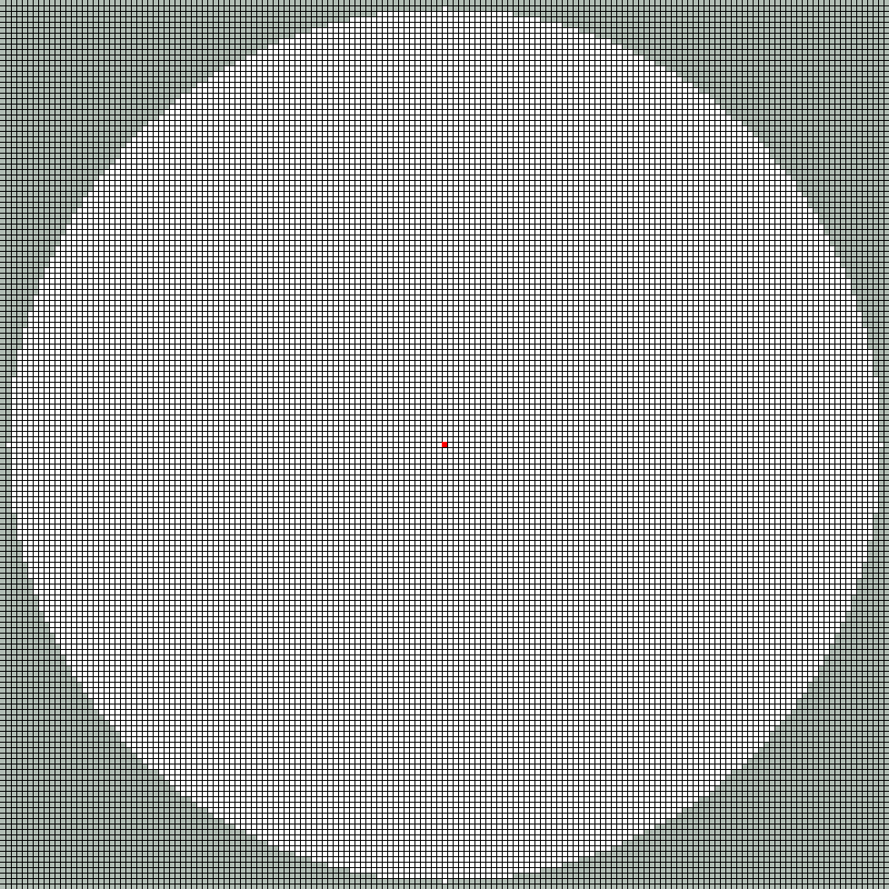
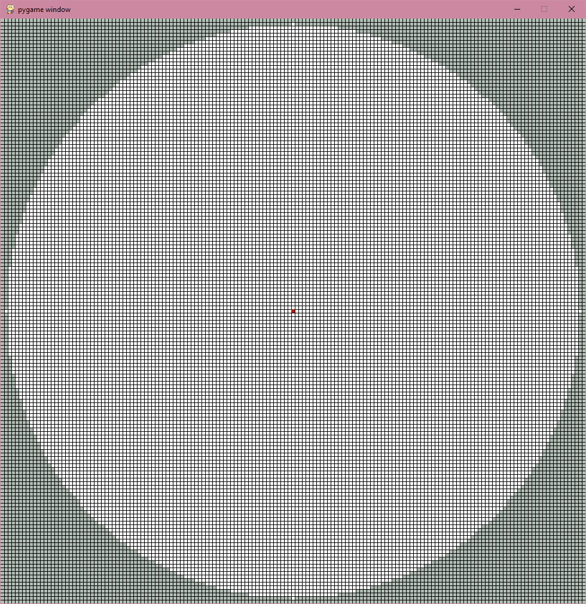

# analog-press
Alternative Digital-to-Analog (DTA) input for box style controllers which aims to more closely follow traditional analog stick behavior. The code in this repository allows you to visualize your inputs for Analog Press, the DTA scheme used in current box-style controllers, and a version of the current scheme with travel time implementation. To see how Analog Press works, head to [DTA Methodology](#dta-methodology). You can also select between 2 [SOCD Resolution Methods](https://www.hitboxarcade.com/blogs/support/what-is-socd#:~:text=What%20is%20an%20SOCD%3F,Right%20at%20the%20same%20time.).

## Try it Yourself!
As this is experimental, it would be great to know if people enjoy how it plays. The code here is just a visualizer, but I have made 2 options you can use to play Melee. I  an implementation of it using Arte's pico rectangle [here](https://github.com/SeamusIngram/pico-rectangle) (Note that you will need to compile the project yourself). If you don't have a pico controller, you can try a keyboard version [here](https://github.com/SeamusIngram/apress-ahk), that is based on [b0xx-ahk](https://github.com/agirardeau/b0xx-ahk), which you might be familiar with if you've played keyboard melee before. Both should work without needing you to adjust the code.
## Dependencies
Currently, to run the project you will need to install python. In the future, a packaged app may be released, but getting started with python is very straightforward. I recommend getting started with [VS Code](https://code.visualstudio.com/docs/python/python-tutorial) if you're brand new to this sort of thing.
You will also need to install [pygame](https://www.pygame.org/wiki/GettingStarted) to run the program.

## General Usage
Run *main.py* to start the program. A window will appear with a grid that visualizes the melee stick coordinates. The squares in grey are values with a distance greater than 1 from the center, and the white squares compose the valid stick coordinates. The red square is the current stick position that is sent to the console. This will be referred to as the **cursor** throughout the readme. To stop the visualization from running, you can either hit your **ESC** key, or close the window. Pressing keys will cause the cursor to move, in the way defined by the selected DTA method.


Default Window Appearance

## Keybindings
The default keybindings are as follows:

This is the default layout I chose for apress-ahk, except that only the buttons necessary to generate or modify coordinate values have been mapped. The keybinds are contained in the *keymap.py* folder. Simply change the variable to the key you wish to use. The names of the pygame constants are available [here](https://www.pygame.org/docs/ref/key.html). 

For example, if I wished to change my B button from the I to O key,
```python
B = pygame.K_i
```
would become
```python
B = pygame.K_o
```
Note that the **NOTCH**, and **SLOW** buttons correspond to **Modifier X** and **Modifier Y** in the standard box input scheme, respectively. 

## SOCD Method Selection
In the **update_pos** function in *main.py*, the value **socd_type** allows you to select which input method to use. When 0, it uses the second-input priority without reactivation (**2IP No Reactivation**, called 'Last Input Controlled Priority' in the SOCD article [here](https://www.hitboxarcade.com/blogs/support/what-is-socd#:~:text=What%20is%20an%20SOCD%3F,Right%20at%20the%20same%20time.)), and when 1 uses **Neutral with Reactivation**. I only included the SOCD methods that are desirable to use. 2IP with reactivation is banned under the most recent Smash World Tour Ruleset, and while you could use Neutral without reactivation, it is unintuitive and unnecessarily limits your inputs.

## DTA Method Selection
Similarly, the value **dac_type** in **update_pos** allows you to select which input method to use. When 0, it uses the standard Frame1 implementation, when 1 uses a Frame1 with travel time (see [Frame 1 with Travel Time](#frame1-with-travel-time) for more), and when 2 uses Analog Press.

## DTA Methodology
### Frame1 DTA
The DTA input coordinates are taken straight from Arte's pico rectangle firmware [here](https://github.com/JulienBernard3383279/pico-rectangle/blob/master/src/dac_algorithms/melee_F1.cpp). This is based on the current Frame1 DAC, which means there are some nerfs found on the b0xx that are not implemented. If you wish to understand why certain coordinates values were chosen, and the combinations of buttons that yield certain coordinates, you can read the **b0xx SSBM [instruction manual](https://drive.google.com/file/d/1InBmEJkWi3E5ReAUIGM9loHygaoNODcf/view).**

### Motivation for Alternative DTA methods
The current DTA scheme in box controllers maps a combination of buttons to a specific coordinate, allowing for fast consistent inputs. These inputs are generated in a fundamentally different way that how an analog stick creates inputs. This can lead to balance issues, as risks associated with certain stick inputs will never occur on a box. It is possible that relative parity between the current digital and analog controllers can be reached through smart changes and regulations, but it can be difficult to determine the best way to achieve balance. Do you implement travel time nerfs? Add randomness to boxes? Do gamecube controllers need a buff? Should it be in game like UCF, or enforced by the controller? There are lots of possible solutions, but it can be hard to find an answer that delivers parity between control schemes, while not changing the balance of the game or upsetting large amounts of the playerbase. By making digital controllers more 'analog', it more closely connects the different styles of controllers, so they are subject to the same risks during gameplay, and makes them more intuitive to balance.

### Frame1 with Travel Time
A potential solution to travel time concerns on digital controllers. It does not eliminate all disparity between analog and digital inputs, but it has been suggested as a way of balancing them. The typically suggested implementation is for the controller to output an intermediate value between the original and final destination when moving to a new coordinate. 

The version implemented here is slightly different. When you want to move to a new coordinate, your cursor moves in a straight line from the current coordinate to the pinpointed value at a constant speed. This travel behaviour is the same as how Analog Press works most of the time. This means when you try to hit a new coordinate, you may not get an intermediate value on the next frame, but you can also get a value very close to the starting position. It all depends on when the game polls the next coordinate. This behaviour is closer to an analog stick than the current. It is far more computationally intensive, however. You can change the speed at which the cursor moves by adjusting **VEL_TRAVEL** in *dac.py*. A slower speed might make the travel more obvious.

This was a more experimental method that I added after the fact, since it combined code from the two other methods I had been working on. I figured I would include it as an alternative.

### Analog Press
Analog press attempts to make it so that a digital button press behaves more like an analog stick. When you press a button, instead of corresponding to a coordinate, it can be thought of as **pushing the analog stick towards a gate.** When I press up, the control stick travels towards the upwards cardinal. If I press up and right, the control stick travels into the North-East gate. This means that the stick will travel across the coordinate space, and can be polled at any coordinate along its path, just like an analog stick.

When you press in a new direction, the cursor will attempt to move in a straight line from your current coordinate towards the target gate. There are 8 targets, accounting for the 8 possible combinations of button inputs: 4 cardinals and 4 diagonal gates. On an analog stick, you would be able to push the stick straight into the rim at any angle. Unfortunately, since digital inputs can only have 4 directional buttons (much more than that would be impractical anyway), we are more limited to specifying 8 target points. Even with this limitation, by changing which direction the stick is moving, you will be able to move your cursor to any possible coordinate value.



You are able to smoothly move through all coordinates!

There is one condition where the stick is not moving in a straight line, and that is when it is **rolling between gates**. If the stick is at the edge of the coordinate circle and you are moving to an adjacent gate, the control stick will move along the edge of the circle, instead of a straight line. This is important for characters whose recovery moves depend on the distance the stick is from the center. A straight path from gate to gate does not achieve the max distance. Also, this rolling motion is more akin to how players move an analog stick between gates, increasing the similarity of these input methods. To more closely match Gamecube controller behaviour, the cursor moves slower when rolling against the edge. Since the stick rubs against the rim during travel, and the thumb has to move in a different motion while against the rim, it makes sense for it to move slower in this state.

This is the general behaviour using the 4 directional buttons. Just like current DTA input schemes, **modifiers** are used to provided additional behaviours to the controller. Note that unlike the current standard, you can hold multiple modifiers at the same time, and their effects will all still apply.

#### Modifiers - Slow
When you press a button the stick will move quickly towards its target at a constant velocity. It moves quickly because desirable actions like dash require a fast movement from one coordinate to the next. There are times when a slower input is needed, such as initiating a tilt input, or to precisely adjust an angle. To do this, you press the **Slow** modifier. The stick behaviour is the exact same for both the fast and slow movements, all that changes is how quickly they occur.


Comparing slow and fast stick movement

#### Modifiers - Hold
The way this system is designed, when pressing a button, the cursor is constantly in motion. If you let go of all the buttons, then the cursor returns to neutral (think of it as letting go of the stick). This presents a challenge. What if I want to hold my stick at a certain position? Say I want to hold a slight DI coordinate, or I think I have reached the angle I want, but need to wait slightly longer to become actionable and use the angle with my next input. To hold the stick at its current position, press the **hold** button, which will freeze the cursor at the current coordinate. It will be frozen for as long as *hold* is pressed, and **at least one direction button is pressed.** If you fully let go of all directions, the stick will return to neutral, and you will not be able to input any other directions until you release *hold*. If you release *hold* at any point, then the cursor will once again move in the direction of your current input.


Holding at a coordinate

#### Modifiers - Notch
Most boxes only have 2 dedicated modifier buttons, but I experimentally wanted to add notch funtionality. If your cursor is currently against the rim, and rolling from a diagonal into an adjacent cardinal, and the **notch** button is pressed, the cursor will be stopped at the notch value. This allows for the targetting of desirable coordinates along the edge, much like a modified Gamecube Controller shell. 8 notch values are permitted, allowing Analog Press to target 16 coordinates (4 cardinals, 4 diagonals, 8 notches).


Rolling the stick into a notch

By default, the notches are set to the maximum allowable angles under the Smash World Tour ruleset **(0.9125,0.3875)**, which is **23°.** Certain characters might want other values. You can adjust the notch coordinates by changing the values in these line of *dac.py*.  

```python
if ((current_region == 2 or current_region == 4) and target_region == 3) or ((current_region == 6 or current_region == 8) and target_region == 7):
  notch_p = region_coords(current_region,Point(31,73))
else:
  notch_p = region_coords(current_region,Point(73,31))
```

Some people might be opposed to this addition, as notches are already a contentious topic on the Gamecube controller, and make hitting good angles consistent with Analog Press. Luckily, it can easily be removed if it is considered too strong. After some consideration, I believe that it would not be an unfair addition. Controllers have notches as well, and the coordinates that can legally be pinpointed with a DTA controller are intentionally limited. Digital controllers are advantaged because they can pinpoit a singular value, and the input is easier on buttons as opposed to a stick.  However they are weaker in the angles they can reach. So long as you are not allowed to pinpoint precise coordinates that allow for special tech, like Peach parasol dash, I think the tradeoffs are fair. A notch button allows Analog Press to wavedash further than a standard rectangle, but comes at the cost of a slightly trickier input, and inability to hit multiple precise angles.

#### Modifier Layout and Design
One further consideration is the ergonomics of the modifiers. Using a third dedicated modifier would require controllers have an additional button, or replace a button in the current layout. Even if there is no **Notch** modifier, you often want to press **Slow** and **Hold** simultaneously, to avoid overshooting the intended coordinate. Because of this, they cannot take the place of both **Modifier X** and **Modifier Y**, because it would be hard for the thumb to press both at the same time. It is important to ensure the controller remains ergonomic, and it **must** be compatible with the layouts of existing hardware. Perhaps there is a way to further improve the layout and design of the modifiers.

#### Other Digital to Analog buttons
This input scheme is only designed with the Left Stick in mind. I don't think this would work as well on the C Stick, and there is probably a better solution. From what I understand, a digital C Stick can provide an advantage analog C Stick, but I don't know enough about the topic to comment on if, or how it should be balanced. As such, this DTA scheme was never meant to apply to the C Stick, and perhaps there is a better way to handle that input(if it needs it at all). It might be good to use the ideas presented here as a starting point.

The same is true for analog shields. You would still need the current lightshield/mediumshield buttons to get analog values. I think that if you wished to include a notch modifier, it could replace the medium shield button, such that existing controllers do not need to add more buttons. Do people use the medium shield on rectangles?

#### Parity
The aim of a more 'analog' DTA input is to avoid the balance issues created by more 'digital' input schemes. I think that it accomplishes this, and this can be seen by looking at travel time and consistency. However there are still some disparities that need to be understood and addressed, so balance is acheieved.

The stick moves with a constant velocity. Currenly there are 4 possible velocities. When it undergoes 'fast' movements, 'slow' movements, rolling along the 'rim', and when the stick is returning to neutral. Obviously, a physical stick will move with a large variety of speeds, but it isn't feasible to implement such complexity. The DTA method should be simple, but move in a way you might expect a player to be able to move the stick. The current velocities were chosed semi-aribtrarily to allow for basic techniques like smash inputs, tilt inputs and more advanced ones dashback out of crouch to be performed. To improve this, basing the stick velocities off of measured results would help to maintain parity. This way, the stick would not be able to move faster than a human can move a stick.

Coordinates are used as targets for stick position, which allows for specific values to be pinpointed. The coordinates are the cardinals and diagonals, which can also be targetted on the Gamecube controller because of the octagonal gates. On the Gamecube controller, due to sensor noise, inability to remain perfectly still and error in the alignment of the stickbox and the shell, it is hard (sometimes impossible) to consistently achieve perfect **cardinals (0.0, 1.0)** or **diagonals (0.7,0.7)**. Even if you can hit these values, the coordinate read by the game will fluctuate when held. While a DTA result will always be more precise, the added precision does not present a significant advantage in this case. A traditional controller can target these values approximately, and because the range of values that generate in-game outputs are large enough at the gates (This had to be fixed in some cases with UCF), having more precision does not create a meaningful advantage. 1.0 cardinal is something to consider, however that is a separate discussion and can be easily implemented. I mentioned notches above, and the need to be careful in allowing players to pinpoint values without restriction.

There are still some disparities, resulting in techniques being much easier to perform than on a Gamecube Controller. For example, pivot tilts are easy; you just need to press the direction you wish to tilt, along with the slow modifier to get your tilt input (timing the pivot is the challenging part of the technique). While not yet implemented, I think balance should be inspired by how the analog stick behaves. Perhaps if the stick is moving quickly, a slow input moves faster than normal for some time, since the difficulty with pivot tilts on an analog stick comes from pinpointing a tilt after the quick pivot input. If the DTA scheme is designed to work like an analog stick, then in theory it should have the same capabilites as an analog stick. The design just needs to provide a close enough analogue. For example, making the stick move slower along the rim made the behaviour more closely match the Gamecube controller. Adding this behaviour was important to make dashback out of crouch, quarter circle SDI and quickly hitting notch angles similar in difficulty to what can be done now. Balance is obviously top of mind, and with more suggestions and changes, I believe it can be reached.

## Contributing
I'm sure people have plenty of thoughts on how to improve balance. I welcome it! Because of some of the disparities mentioned above I do think it is **stronger than a controller currently**. I do not have the expertise to fully balance the system by myself, nor do I want to do all the work. Please, experiment with the code to make it fair and intuitive to use. Pull requests are welcome. For major changes, please open an issue first to discuss what you would like to change.

## License
[GPLv3](https://www.gnu.org/licenses/gpl-3.0.en.html)
